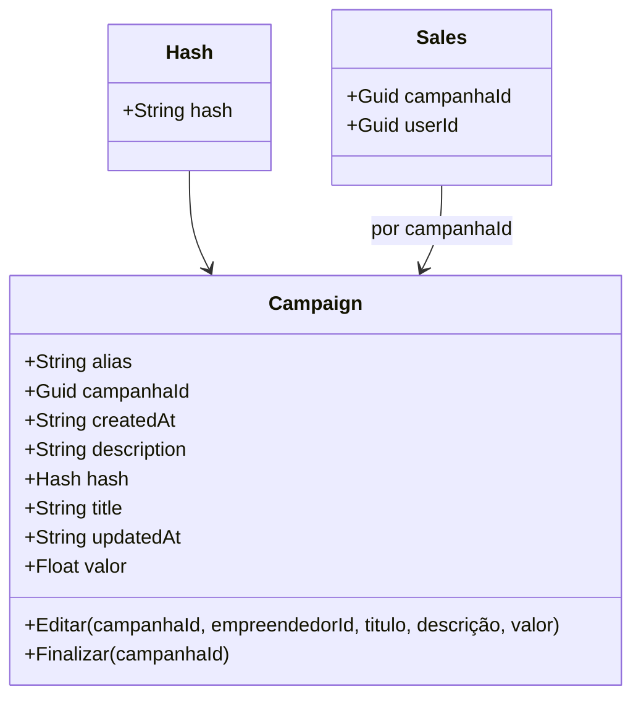

# 📚 Trabalho — Design Tático no DDD

---

## 🩺 1) Sobre o Domínio Escolhido
**Nome do domínio:** **Colheita Digital**  
**Objetivo do sistema:** **Transações com Blockchain**  
**Principais atores:** **Investidor, Empreendedor e Consumidor**  
**Contextos (opcional):** **Relacionamentos, Tesouraria, Campanha**

---

## 🧩 2) Entidades vs Value Objects

| Elemento | Tipo (Entidade/VO) | Por quê? (identidade/imutável) |
|-------------------|-------------------------------|-------------------------------------------------------------------------------|
| **Investidor**    | Entidade                      | Tem um ID único, dados atualizáveis ​​e pode interagir com muitas campanhas.    |
| **Empreendedor**  | Entidade                      | Tem um ID único, dados atualizáveis ​​e pode criar com muitas campanhas.        |
| **Consumidor**    | Entidade                      | Tem um ID único, dados atualizáveis ​​e pode consumir de vários empreendedores. |
| **Endereço**      | Value Object                  | Organiza as informações de endereço dos usuários.                             |
| **Wallet**        | Value Object                  | Guarda e valida o endereço da wallet dos usuários.                            |
| **CPF**           | Value Object                  | Guarda e valida o CPF dos usuários.                                           |

---

## 🏗️ 3) Agregados e Aggregate Root (AR)
**Agregado Principal:** **Campanha**  
**Conteúdo interno do agregado:**  
- **Investidor (Entidade)**
- **Empreendedor (Entidade)**

**Referências a outros agregados (por ID):**  
- **ConsumidorId**

**Boundary — Por que cada item está dentro/fora?**  
- **Dentro porque é necessário um consumidor para a transação e alguns dos dados usando consistencia eventual**

---

## 🧭 4) Invariantes e Máquina de Estados
Liste invariantes.

**Invariantes:**
- **Todas as alterações são irreversiveis**
- **O usuário precisa ter saldo na carteira para realizar transações**
- **O usuário precisa de uma Wallet conectada**

**Estados e transições da AR Campanha:**
```
[Criar Campanha] -> [Campanha criada]
Regras:
- Usuário ativo

[Editar Campanha] -> [Campanha editada]
Regras:
- Usuário ativo
```

---

## 🗃️ 5) Repositório do Agregado (interface)
> Repositório trabalha **apenas com a AR**, sem expor entidades internas do agregado. Consultas analíticas ficam fora (read models).

**Linguagem livre**:
```kotlin
data class Campaign(
	val alias: String,
	val createdAt: String,
	val description: String,
	val hash: String,
	val id: String,
	val title: String,
	val updatedAt: String,
	val valor: Float,
)

data class Wallet(
	val hash: String
)

interface ICampaignRepository {
    fun create(campaign: Campaign)
    fun delete(campaignIdOrAlias: String)
    fun find(campaignIdOrAlias: String)
    fun update(campaign: Campaign)
    fun invest(amount: Float, campaignIdOrAlias: String, userWallet: Wallet)
}

interface ISaleRepository {
    fun order(productIds: List<String>, userId: String)
}
```


---

## 📣 6) Eventos de Domínio
Defina **2–4 eventos** com **payload mínimo** e **momento de publicação** (preferir **pós-commit**). Diferencie **evento interno** vs **evento de integração**.

| Evento | Quando ocorre | Payload mínimo | Interno/Integração | Observações |
|---|---|---|---|---|
| **[CampanhaCriada]** | [ao criar campanha] | [campanhaId, empreendedorId, titulo, descrição, valor] | [Interno] | [Empreendedor] |
| **[CampanhaEditada]** | [ao editar campanha] | [campanhaId, titulo, descrição, valor] | [Interno] | [Empreendedor] |
| **[CampanhaFinalizada]** | [ao finalizar campanha] | [campanhaId] | [Interno] | [Empreendedor] |

---

## 🗺️ 8) Diagrama (Mermaid ou ferramenta à sua escolha)
> Mostre **Agregados/AR**, **VOs** e **relacionamentos por ID** entre agregados (não “contenha” outros agregados).

**Exemplo de esqueleto Mermaid:**


---

## ✅ Checklist de Aceitação
- [ ] **VOs imutáveis** e com **igualdade por valor**.
- [ ] **Boundary do agregado** pequeno e com **invariantes claras**.
- [ ] **Domínio rico**: operações do negócio como métodos (evitar `set` aberto).
- [ ] **Repositório** focado na **AR** (sem `IQueryable`/detalhes de ORM no domínio).


## 📤 Entrega

- [Eventos](https://miro.com/app/board/uXjVIkkp3k4=/?moveToWidget=3458764645799234646&cot=14).
- [Eventos](./eventos.jpeg)
- [Diagrama](./diagrama.pdf)
---
