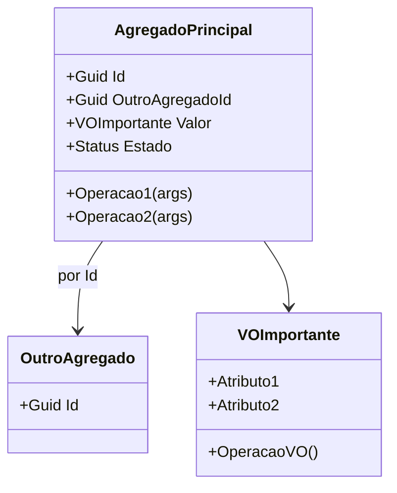

# 📚 Trabalho — Design Tático no DDD (Template para qualquer domínio)

> **Como usar:** copie este arquivo e substitua os **[colchetes]** com informações do **seu domínio** (e-commerce, marketplace, logística, educação, fintech, games, etc.).
> O objetivo é praticar Entidades, Value Objects, Agregados/AR, Repositórios e Eventos de Domínio — com foco em **invariantes** e **domínio rico**.

---

## 🚀 Quick start (5 passos)
1. Escolha um **domínio** que você conheça (ex.: **[Seu Domínio]**).
2. Liste 3–7 **invariantes** que devem estar corretas no **commit**.
3. Escolha 1–2 **Agregados principais** (comece por **[Agregado Principal]**).
4. Desenhe a **máquina de estados** e os **eventos** que surgem das transições.
5. Defina o **Repositório** da AR e como lidará com **consistência** entre agregados.

---

## 🩺 1) Sobre o Domínio Escolhido
**Nome do domínio:** **Colheita Digital**  
**Objetivo do sistema:** **Transações com Blockchain**  
**Principais atores:** **Investidor, Empreendedor e Consumidor**  
**Contextos (opcional):** **Relacionamentos, Tesouraria, Campanha**

---

## 🧩 2) Entidades vs Value Objects
Preencha a tabela justificando cada tipo (identidade vs. imutabilidade).

| Elemento | Tipo (Entidade/VO) | Por quê? (identidade/imutável) |
|-------------------|-------------------------------|-------------------------------------------------------------------------------|
| **Investidor**    | Entidade                      | Tem um ID único, dados atualizáveis ​​e pode interagir com muitas campanhas.    |
| **Empreendedor**  | Entidade                      | Tem um ID único, dados atualizáveis ​​e pode criar com muitas campanhas.        |
| **Consumidor**    | Entidade                      | Tem um ID único, dados atualizáveis ​​e pode consumir de vários empreendedores. |
| **Endereço**      | Value Object                  | Organiza as informações de endereço dos usuários.                             |
| **Wallet**        | Value Object                  | Guarda e valida o endereço da wallet dos usuários.                            |
| **CPF**           | Value Object                  | Guarda e valida o CPF dos usuários.                                           |


> Dica: Promova tipos semânticos: `Email`, `CPF/CNPJ`, `Money`, `IntervaloDeTempo`, `Endereco`, `Percentual`, `Quantidade`, etc. **VOs devem ser imutáveis** e com **igualdade por valor**.

---

## 🏗️ 3) Agregados e Aggregate Root (AR)
**Agregado Principal:** **[Agregado Principal]**  
**Conteúdo interno do agregado (apenas o necessário para consistência local):**  
- **[Entidade interna/VO]**
- **[Entidade interna/VO]**

**Referências a outros agregados (por ID):**  
- **[OutroAgregadoId]** (não conter dentro do agregado)
- **[OutroAgregadoId]**

**Boundary — Por que cada item está dentro/fora?**  
- **Dentro porque [precisa de consistência transacional por causa da invariante X]**  
- **Fora porque [pode esperar/eventual; pertence a outro BC; só precisa de referência por ID]**

---

## 🧭 4) Invariantes e Máquina de Estados
Liste invariantes (devem ser verdadeiras ao final de cada transação).

**Invariantes (exemplos):**
- **[Não aceitar pagamento acima do limite de crédito]**
- **[Não permitir slot de horário sobreposto para o mesmo recurso]**
- **[Não permitir alteração após estado X]**
- **[Preço Total = soma dos itens] (se aplicável)**

**Estados e transições da AR [Nome da AR]:**
```
[EstadoInicial] -> [Estado1] -> [Estado2] -> [EstadoFinal]
Regras:
- [Transição A] permitida se [condições/invariantes]
- [Transição B] bloqueada se [condições]
- [Transição C] exige [política/serviço]
```

---

## 🗃️ 5) Repositório do Agregado (interface)
> Repositório trabalha **apenas com a AR**, sem expor entidades internas do agregado. Consultas analíticas ficam fora (read models).

**Linguagem livre** (ex.: C#, Java, Kotlin, TS). Exemplo (C# assíncrono, adapte nomes):
```csharp
public interface I[Agregado]Repository
{
    Task<[Agregado]?> ObterPorIdAsync(Guid id, CancellationToken ct = default);
    Task AdicionarAsync([Agregado] entidade, CancellationToken ct = default);
    Task SalvarAsync([Agregado] entidade, CancellationToken ct = default);
}
```


---

## 📣 6) Eventos de Domínio
Defina **2–4 eventos** com **payload mínimo** e **momento de publicação** (preferir **pós-commit**). Diferencie **evento interno** vs **evento de integração**.

| Evento | Quando ocorre | Payload mínimo | Interno/Integração | Observações |
|---|---|---|---|---|
| **[EventoXOcorrido]** | [ao confirmar/remarcar/etc.] | [ids, valores necessários] | [Interno/Integração] | [idempotência, consumidor] |
| **[EventoYOcorrida]** | [...] | [...] | [...] | [...] |
| **[EventoZOcorrida]** | [...] | [...] | [...] | [...] |

---

## 🗺️ 8) Diagrama (Mermaid ou ferramenta à sua escolha)
> Mostre **Agregados/AR**, **VOs** e **relacionamentos por ID** entre agregados (não “contenha” outros agregados).

**Exemplo de esqueleto Mermaid:**


---

## ✅ Checklist de Aceitação
- [ ] **VOs imutáveis** e com **igualdade por valor** (nada de “string de CPF/Email”).
- [ ] **Boundary do agregado** pequeno e com **invariantes claras**.
- [ ] **Domínio rico**: operações do negócio como métodos (evitar `set` aberto).
- [ ] **Repositório** focado na **AR** (sem `IQueryable`/detalhes de ORM no domínio).


## 📤 Entrega

- **Inclua**: link/imagem do **diagrama** + todas as seções acima preenchidas.
---
